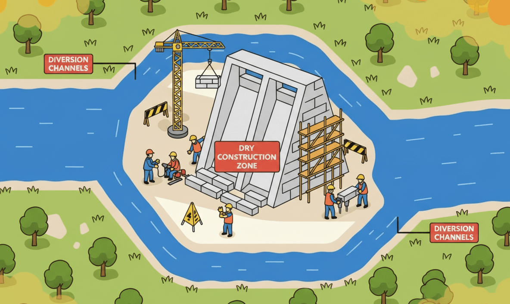
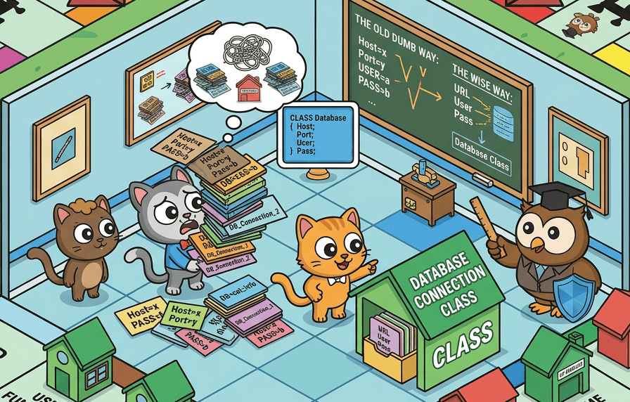

# Safe Refactoring with the Introduce Parameter Object Pattern

## Motivation

Refactoring can feel risky, especially in code that is not well protected by unit tests, which is why the standard recommendation is to build a dense safety net of tests. However, for some refactorings, such as `Introduce Parameter Object`, a large number of tests can actually make migration harder because public function interfaces change in a meaningful way. That can break many tests at once and reduce trust in the test suite.

As a result, many developers may feel discouraged from using this pattern. However, experts such as Martin Fowler and Robert C. Martin agree that it is a key refactoring that can significantly improve maintainability. In Clean Code, Robert C. Martin defines several attributes of a clean function. One of them concerns the number of parameters:

> Function Arguments: The ideal number of arguments for a function is Zero. Next comes One, followed closely by Two. Three arguments should be avoided where possible. More than three is intolerable. Most of the cases, they can be extracted into a class. --- **Robert C. Martin** - Clean Code: A Handbook of Agile Software Craftsmanship, 2008.

In Refactoring, Martin Fowler describes the code smell associated with too many parameters:

> Data Clumps: This is one of my favorite CodeSmells from the refactoring book. You spot it when you constantly see the same few data items passed around together. start and end are a good example of a data clump wanting to be a range. Often data clumps are primitive values that nobody thinks to turn into an object. --- **Martin Fowler** - Refactoring: Improving the Design of Existing Code, 2016.

In this article, I want to show skeptical readers how to introduce this pattern safely, even in code that already has a dense network of unit tests. I will use a practical Monopoly example to illustrate the process. Introducing this pattern is a bit like a technique used in civil engineering called a diversion channel. It creates a safe construction zone while the main structure is being rebuilt. During code migration, we temporarily keep both the old and the new public interfaces in place. That works like a diversion channel that redirects traffic from one route to another while the old route is gradually closed.



## Pattern: Introduce Parameter Object

As mentioned earlier, this pattern is an important tool in the refactoring toolbox. It improves readability and cohesion by grouping related parameters into a single object. It is especially useful when you have a function or method that accepts many parameters.

The pattern was introduced by Martin Fowler. He encourages its use especially when you see a function or method that takes several parameters, usually more than two, that:

- often appear together
- belong to one logical context
- make the function signature hard to understand
- force repeated multi-line data setup in tests, especially in the arrange section

The Data Clumps smell causes a general decline in code quality. It scatters knowledge about operations across multiple modules, which makes the code harder to evolve and bugs harder to fix. The `Introduce Parameter Object` pattern addresses that smell by creating a clear boundary for related data and operations. When you find a function with these weaknesses and it also plays an important role in the project, you have probably found a strong candidate for this refactoring.



There are many other design patterns and refactorings that can improve code, but in this article I will focus only on `Introduce Parameter Object` and the related `Data Clumps` smell.

## Monopoly - illustrating the problem

I will illustrate the problem with a practical example from a Delphi project that powers a digital version of the Monopoly board game.

Before the refactoring started, the project had several functions and procedures that accepted between two and four related arguments, such as `Players` and `Board`. At the same time, code operating on game state was spread across different units. That made the state and the core logic harder to understand and modify.

- Game state was split across several separate values:
  - `Players` - a list of player objects, each with its own properties such as `Position`, `IsBankrupt`, `Id`, and so on
  - `Board` - an object representing the board, containing tiles with properties such as `TileType`, `Name`, `Price`, and so on
  - `CurrentPlayerId` - the identifier of the current player
  - `CurrentDiceRoll` - the most recent dice roll
- Functions operating on game state were spread across multiple units:
  - `RollDice()` - a function responsible for simulating a dice roll, used in many places but not tied to any specific game object
  - `CurrentPlayer(const APlayers: TObjectList<TPlayer>; APlayerId: Integer)` - a function that returned the current player based on `CurrentPlayerId`, but was defined in a different unit from the player-related code
  - `GetActivePlayers(const APlayers: TObjectList<TPlayer>)` - a function that returned the list of active players
  - `CountActivePlayers(const APlayers: TObjectList<TPlayer>)` - a function that counted active players
  - `NextActivePlayer(const APlayers: TObjectList<TPlayer>; APlayerId: Integer)` - a function that returned the next active player
- Key game logic lived in functions that accepted different combinations of those values:
  - `MovePlayer()` - movement logic on the board, and the main place where the Data Clumps smell appeared
  - `ProcessLocationRules()` - rules for handling the newly reached location
  - `ProcessPayRentRules()` - rules for paying rent after landing on another player's property
  - `ProcessBankruptcyRules()` - bankruptcy rules that checked whether the player went bankrupt after each financial operation

Initially, the main game loop looked like this. It is simplified for illustration and does not represent the exact implementation:

```pascal
procedure RunGame;
var
  Board: TBoard;
  Players: TObjectList<TPlayer>;
  Player: TPlayer;
  Roll: TDiceRoll;
  CurrentPlayerId: Integer;
  DoublesCount: Integer;
  HasDouble: Boolean;
begin
  Board := CreateBoard;
  Players := CreatePlayers([
    'Luke Skywalker',
    'Darth Vader',
    'Han Solo',
    'Leia Organa'
  ]);
  try
    ShowIntro(Players);

    Player := NextActivePlayer(Players, CurrentPlayerId);
    while Assigned(Player) do
    begin
      DoublesCount := 0;
      HasDouble := True;

      while HasDouble and (DoublesCount < 3) and not Player.IsBankrupt do
      begin
        Roll := RollDice;
        MovePlayer(Player, Board, Players, Roll.Total);

        HasDouble := Roll.IsDouble;
        if HasDouble then
          Inc(DoublesCount);
      end;

      Player := NextActivePlayer(Players, CurrentPlayerId);
    end;

    ShowSummary(Players);
  finally
    Players.Free;
    Board.Free;
  end;
end;
```

This version works, but the data and functions it relies on are scattered. If you want to change how active players are tracked, how turns are ordered, or how utilities and electric company rules are handled, you need to touch several places at once.

Problems that are already visible from the outside become much worse inside `MovePlayer()`. It takes four parameters: `APlayer`, `ABoard`, `APlayers`, and `ARollTotal`, and it contains a lot of crucial game rules, such as going to jail, checking whether the player is bankrupt, and deciding whether the player landed on someone else's property and must pay rent. This is a large function with too many responsibilities, and even in its current state it is hard to understand and modify. As the project grows, this area can only get worse. An early design shortcut, keeping game state in many separate values, makes it much harder to introduce changes such as a flexible rules system that follows the Open-Closed Principle from SOLID.

## Architectural comment

I already mentioned the Open-Closed Principle, but there is another SOLID principle that matters a lot for this refactoring: the Single Responsibility Principle.

SRP says that a class should not become too large and, more precisely, that it should have only one reason to change. In the Monopoly context, a `TGame` object should be responsible for managing game state. It is very easy to violate SRP with an object like this because it may seem natural to put every game-related concern into it, even REST communication or file persistence. Drawing the right boundary takes experience and practice. We should not even put property-purchase rules or rent-payment rules into it. Those responsibilities should live in separate modules or classes.

Look for a boundary that groups closely related values, not a bucket for everything. Keep one key rule in mind: do not push too much into one object. If the boundary grows too wide, narrow the responsibility again, usually by splitting the object into smaller parts. Defining boundaries well is a central part of software design, and many principles address it, including SRP, Separation of Concerns, and Event Storming in Domain-Driven Design. An oversized bucket object with too many responsibilities is commonly known as a God Object, which is an anti-pattern.

## Refactoring step by step

1. **Create the `TGame` object.**
  - Create a `TGame` class and a simple factory function `CreateGame(const APlayerNames: array of string): TGame` that returns an instance with the initial game state, including the player list, the board, the current player, and helper methods for navigating the state.
   - Make sure `CreateGame()` is well tested so you can trust the shape and behavior of the returned object. This is a critical step because `TGame` becomes the new boundary for many functions, so it must be stable and well defined.
    ```pascal
    [Test]
    procedure TGameFactoryTests.CreateGame_ReturnsExpectedShape;
    var
      Game: TGame;
    begin
      Game := CreateGame(['Luke', 'Leia']);
      try
        Assert.AreEqual(2, Game.Players.Count);
        Assert.AreEqual(-1, Game.CurrentPlayerId);
        Assert.IsNotNull(Game.Board);
      finally
        Game.Free;
      end;
    end;
    ```
    - Move to the next step when you have strong tests for `CreateGame()`.
2. **Introduce the diversion channel.**
   - Create `MovePlayerNew()`, but let it delegate internally to the old function so that existing behavior stays intact. This lets you migrate calls to `MovePlayer` gradually without immediately breaking the test suite.
    ```pascal
    procedure MovePlayerNew(AGame: TGame);
    begin
      MovePlayer(
        AGame.CurrentPlayer,
        AGame.Board,
        AGame.Players,
        AGame.CurrentDiceRoll.Total);
    end;
    ```
   - Move to the next step when you have verified that `MovePlayerNew()` works correctly in at least one test.
3. **Update the tests.**
   - Update the `MovePlayer` tests to use `MovePlayerNew(Game)`. Estimate the size of the migration. If it will take longer, keep both test variants in place and migrate them gradually, one by one.
   - Run the tests often to make sure they still pass. Enabling watch mode helps here.
    ```pascal
    [Test]
    procedure TMovePlayerTests.ObiWanPassesStartAndBuysLocation;
    var
      Game: TGame;
    begin
      Game := CreateTestGame([
        TTestPlayerData.Create('Obi-Wan', 31, 1500)
      ]);
      try
        Game.CurrentDiceRoll := TDiceRoll.Create(10, False);

        MovePlayerNew(Game);

        Assert.AreEqual(1, Game.Players[0].Position);
        Assert.AreEqual(1500 + 200 - 60, Game.Players[0].Money);
      finally
        Game.Free;
      end;
    end;
    ```
   - Move to the next step when all tests pass.
4. **Migrate production calls.**
   - Update all calls from `MovePlayer(APlayer, ABoard, APlayers, ASteps)` to `MovePlayerNew(AGame)`. Again, if the migration is large, keep both variants and move gradually, running tests after each change.
   - To make progress easier to track, you can rename the old function to `MovePlayerOld()` so it is always clear which version is still used in production code.
   - Move the full implementation of player movement into `MovePlayerNew()`. That lets you gradually remove the dependency on the old function.
   - When finished, make sure all tests still pass.
   - Remove the old `MovePlayerOld()` function and any obsolete tests.
   - Rename `MovePlayerNew()` back to `MovePlayer()`.

Changing everything at once would be risky and could easily damage the test suite, miss a critical scenario, or introduce production bugs. A safer path is this:

1. Keep the old behavior intact until the very end of the migration.
2. Add a temporary adapter that delegates to the old function.
3. Migrate tests gradually.
4. Collapse the production code into the final `MovePlayer(AGame)` form.

The `MovePlayerNew` adapter is not the goal. It is only a migration aid. You introduce it to preserve behavior while callers move from the old function signature to the new one. That is why the diversion channel is such a useful metaphor. It gives you a dry construction zone where you can make changes safely and then gradually move traffic from the old route, the old function signature, to the new route, the new function signature. Once all traffic is on the new route, the old one can be removed and the new one becomes the only path forward.

## Example of `TGame` and the adapter

This is what the new project boundary around the `TGame` object can look like:

```pascal
type
  TGame = class
  private
    FBoard: TBoard;
    FPlayers: TObjectList<TPlayer>;
    FCurrentPlayerId: Integer;
    FCurrentDiceRoll: TDiceRoll;
    function GetCurrentPlayer: TPlayer;
    function IndexOfActivePlayer(const AActivePlayers: TArray<TPlayer>;
      APlayerId: Integer): Integer;
  public
    constructor Create(const APlayerNames: array of string);
    destructor Destroy; override;
    function RollDice: TDiceRoll;
    function GetActivePlayers: TArray<TPlayer>;
    function CountActivePlayers: Integer;
    function TrySelectNextActivePlayer: Boolean;
    property Board: TBoard read FBoard;
    property Players: TObjectList<TPlayer> read FPlayers;
    property CurrentPlayer: TPlayer read GetCurrentPlayer;
    property CurrentPlayerId: Integer read FCurrentPlayerId write FCurrentPlayerId;
    property CurrentDiceRoll: TDiceRoll read FCurrentDiceRoll write FCurrentDiceRoll;
  end;

function CreateGame(const APlayerNames: array of string): TGame;
begin
  Result := TGame.Create(APlayerNames);
end;

constructor TGame.Create(const APlayerNames: array of string);
begin
  inherited Create;
  FPlayers := CreatePlayers(APlayerNames);
  FBoard := CreateBoard;
  FCurrentPlayerId := -1;
  FCurrentDiceRoll := Default(TDiceRoll);
end;

destructor TGame.Destroy;
begin
  FBoard.Free;
  FPlayers.Free;
  inherited;
end;

function TGame.RollDice: TDiceRoll;
begin
  Result := RollDiceCore;
  FCurrentDiceRoll := Result;
end;

function TGame.GetCurrentPlayer: TPlayer;
var
  Player: TPlayer;
begin
  for Player in FPlayers do
    if Player.Id = FCurrentPlayerId then
      Exit(Player);

  Result := nil;
end;

function TGame.GetActivePlayers: TArray<TPlayer>;
var
  Player: TPlayer;
  ActivePlayers: TList<TPlayer>;
begin
  ActivePlayers := TList<TPlayer>.Create;
  try
    for Player in FPlayers do
      if not Player.IsBankrupt then
        ActivePlayers.Add(Player);

    Result := ActivePlayers.ToArray;
  finally
    ActivePlayers.Free;
  end;
end;

function TGame.CountActivePlayers: Integer;
begin
  Result := Length(GetActivePlayers);
end;

function TGame.IndexOfActivePlayer(const AActivePlayers: TArray<TPlayer>;
  APlayerId: Integer): Integer;
begin
  for Result := 0 to High(AActivePlayers) do
    if AActivePlayers[Result].Id = APlayerId then
      Exit;

  Result := -1;
end;

function TGame.TrySelectNextActivePlayer: Boolean;
var
  ActivePlayers: TArray<TPlayer>;
  CurrentIndex: Integer;
begin
  ActivePlayers := GetActivePlayers;
  if Length(ActivePlayers) < 2 then
  begin
    FCurrentPlayerId := -1;
    Exit(False);
  end;

  if CurrentPlayer = nil then
    FCurrentPlayerId := ActivePlayers[0].Id
  else
  begin
    CurrentIndex := IndexOfActivePlayer(ActivePlayers, CurrentPlayer.Id);
    FCurrentPlayerId := ActivePlayers[(CurrentIndex + 1) mod Length(ActivePlayers)].Id;
  end;

  Result := True;
end;
```

## Final advice

The `Introduce Parameter Object` pattern may be expensive to introduce, but it pays back with every change that comes later.

Practicing refactoring is part of what separates a good engineering team from an average one. A strong team lead should encourage developers to refactor, which in turn means investing time in a solid unit test suite. Missing or weak tests are a common reason why teams avoid refactoring, which then leads to declining code quality and fast-growing technical debt. Large technical debt reduces team productivity and morale, and in extreme cases it leads to rewriting the whole project in a supposedly better technology. That is expensive, risky, and rarely delivers the expected results, because the same team often repeats the same mistakes, while a brand new team may lack the domain knowledge and experience needed to do better.

On the other hand, designing in advance for every future need is very difficult in practice, and often impossible. When we design a system, we do not have complete knowledge of future requirements, and even if we think we do, those requirements may still change. That is why it is so important to have tools and techniques for introducing change safely. Their purpose is to improve code quality and make the system easier to maintain over time.

Refactoring is not a rigid set of rules. It is a set of practical guidelines that require adaptation and judgment. They help developers make conscious decisions while transforming weak code. In the case of `Introduce Parameter Object`, the key principle is to avoid creating a boundary that is too broad. Do not try to move the entire game state into one `TGame` object all at once, because that can lead directly to a God Object that is hard to understand and maintain.

When code changes look risky, do not start by redesigning the entire system. Use this decision tree instead:

1. **Do you have strong unit tests?** If not, build them first.
2. **Can you introduce a temporary adapter that delegates to the old function?** If not, the scope is still too large, so split it further.
3. **Can you migrate tests one by one?** If not, the scope is still too large, so split it further.

If you can answer yes to all three, you are probably ready to refactor safely.

## References

1. Martin Fowler - Refactoring: Improving the Design of Existing Code. https://martinfowler.com/books/refactoring.html
2. Robert C. Martin - Clean Code: A Handbook of Agile Software Craftsmanship. https://www.goodreads.com/book/show/3735293-clean-code
3. Martin Fowler - Data Clump Code Smell. https://martinfowler.com/bliki/DataClump.html
4. SOLID principles - Wikipedia. https://en.wikipedia.org/wiki/SOLID
5. Refactoring Guru - Introduce Parameter Object. https://refactoring.guru/introduce-parameter-object/
6. Refactoring Guru - Data Clumps. https://refactoring.guru/smells/data-clumps/
7. Refactoring Guru - Large Class. https://refactoring.guru/smells/large-class