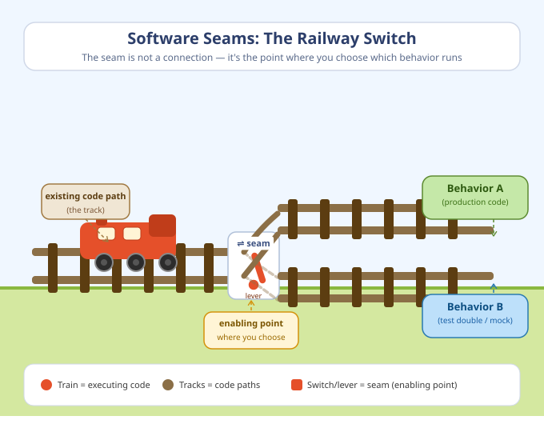

# Software Seam

Michael Feathers coined the term "seam" in the context of legacy code. His definition is short, but it can feel abstract on first read:

> "A seam is a place where you can alter behavior in your program without editing in that place."

In simpler words:

- a seam is a safe switching point
- it lets you change what happens next
- it does that without rewriting the whole area around it

That is why seams matter so much in refactoring. When code is hard to change, a seam gives you one controlled place where you can introduce a new path.

## A Real-Life Analogy

Think about a railway switch.

The tracks already exist, but one small switch decides which direction the train takes. You do not rebuild the whole railway to change the route. You change the switch position.

Software seams work in a similar way:

- the track is the existing code path
- the switch is the seam
- the lever position is the enabling point where you choose one path or another

Key point to understand Software Seams is not connection point between two pieces (two code versions), but how easy   it's to choose which behavior runs this or another moment.



## Why Feathers Cares About Seams

Feathers' main problem was legacy code: code that is risky to change because you do not yet have safe feedback. Often the code is tightly connected to too many things at once:

- global functions
- external systems
- hard-coded dependencies
- long call chains
- state spread across many files

If you change everything at once, you do not know what broke.

A seam solves that by giving you one narrow insertion point. Once you have that point, you can:

- break a dependency for tests
- redirect a call to new code
- add observability
- refactor in smaller steps

Martin Fowler adds another useful term: the enabling point. That is the place where you choose which behavior to use.

So there are really two parts:

- the seam: the place where behavior can vary
- the enabling point: the place where you choose the old path or the new path

## The Simplest Way to Recognize a Seam

Ask this question:

"Can I make this code behave differently without rewriting the code right here?"

If the answer is yes, you probably found a seam.

Examples:

- pass a different function as an argument
- call through a wrapper object instead of directly calling a dependency
- introduce a helper method that delegates to existing code for now

Notice what is not automatically a seam:

- moving state into one object
- changing a function signature
- adding an adapter only for migration

Those can be useful refactorings, but they become seams only if they create a place where behavior can later be substituted without editing that call site.

## Preparing a Seam in This Monopoly Project

This project used to have game state spread across separate values:

- `players`
- `board`
- `rollDice`
- turn flow logic inside `playRound()`
- player movement in `movePlayer()`

Earlier style:

```js
const board = createBoard();
let players = createPlayers(["Luke Skywalker", "Darth Vader"]);

showIntro(players);

for (let turn = 0; turn < 10; turn++) {
  playRound(players, board);
}

showSummary(players);
```

That older style worked, but it spread game state across multiple arguments and multiple files. If you wanted to change turn order, current-player tracking, or active-player rules, you had to touch several places at once.

The refactor introduced a safer structure:

```js
const game = createGame(["Luke Skywalker", "Darth Vader"]);

showIntro(game.players);

for (let turn = 0; turn < 10; turn++) {
  playRound(game);
}

showSummary(game.players);
```

That `game` object is not itself a seam in Feathers' sense. It is a state container and an software system boundary.

Why is it still useful?

- it centralizes state in one object
- it gives `movePlayer()` and `playRound()` one stable entry point

That matters because this refactor creates room for actual seams around replaceable behavior. Once callers receive a `game` object, methods such as `game.rollDice()` or `game.currentPlayer()` can act as object seams if the caller can receive a different implementation without editing the caller.

So the important distinction is:

- `createGame()` is a preparatory refactoring
- the `game` object is a convenient boundary for state and behavior
- the seam appears at the replaceable call, not in the data container itself

## Before And After: Why This Change Helps

Before the refactor, movement depended on several separate arguments:

```js
movePlayer(player, steps, board, players);
```

After the refactor, the call became:

```js
movePlayer(game, steps);
```

That is still a useful change, but it is not the seam by itself. It is an API migration that prepares the code for seams.

What it changes is dependency shape: `movePlayer()` no longer needs the caller to assemble every piece of state manually. The caller passes one object, and `movePlayer()` can now reach behavior through that object:

```js
const player = game.currentPlayer();
```

Now we are closer to a true object seam. If `movePlayer()` depends on `game.currentPlayer()`, then the seam is that method call. The enabling point is wherever we decide which `currentPlayer()` implementation `movePlayer()` receives.

For example, in a test you could supply a controlled implementation:

```js
const game = createGame(["Luke", "Leia"]);
game.currentPlayer = () => game.players[1];

movePlayer(game, 2);
```

`movePlayer()` does not change. The behavior changes because the test chose a different implementation at the enabling point.

This is the key simplification produced by the refactor:

- before: many callers know too much
- after: one boundary makes it easier to introduce replaceable calls behind `game`

## Why This Refactor Is Safe

The attached refactoring note describes the intended sequence, and the implemented commits follow the same spirit.

The sequence is:

1. introduce a new seam
2. prove it with focused tests
3. migrate one caller at a time
4. run the smallest useful test slice
5. run the full suite last

This is classic safe refactoring.

The important part is not "introduce a big new design". The important part is "prepare a place where behavior can later vary safely".

In this project, that means:

1. create `createGame(playerNames)`
2. verify the game object shape in isolation
3. move `movePlayer()` to `movePlayer(game, steps)` so dependencies are routed through one boundary
4. move `playRound()` to `playRound(game)` for the same reason
5. update `index.js`
6. migrate `locationRules` through a temporary adapter until the final `handle(game)` API is safe to keep

That is exactly what safe refactoring looks like: first prepare the boundary, then introduce or exploit seams at specific call sites.

## Code Sample Adapted To This Project

Here is a small example of how a preparatory refactor can make a later seam possible.

### Without the seam

```js
export function playRound(players, board) {
  for (const player of players) {
    if (player.isBankrupt) {
      continue;
    }

    executePlayerTurn(player, board, players);
  }
}
```

This version works, but turn selection is mixed directly into round execution.

### With the refactored boundary

```js
export function createGame(playerNames) {
  const players = createPlayers(playerNames);

  const game = {
    currentPlayerId: null,
    players,
    board: createBoard(),
    rollDice,
    currentPlayer() {
      return this.players.find((player) => player.id === this.currentPlayerId) ?? null;
    },
    getActivePlayers() {
      return this.players.filter((player) => !player.isBankrupt);
    },
    countActivePlayers() {
      return this.getActivePlayers().length;
    },
    nextActivePlayer() {
      if (this.players.length === 0) {
        this.currentPlayerId = null;
        return false;
      }

      const activePlayers = this.getActivePlayers();

      if (activePlayers.length === 0) {
        this.currentPlayerId = null;
        return false;
      }

      if (this.currentPlayerId === null) {
        this.currentPlayerId = activePlayers[0].id;
        return true;
      }

      const currentIndex = activePlayers.findIndex(
        (player) => player.id === this.currentPlayerId,
      );

      if (currentIndex === -1) {
        this.currentPlayerId = activePlayers[0].id;
        return true;
      }

      const nextIndex = (currentIndex + 1) % activePlayers.length;
      this.currentPlayerId = activePlayers[nextIndex].id;
      return true;
    },
  };

  return game;
}
```

Then `playRound()` can depend on that boundary:

```js
export function playRound(game) {
  const turnsToPlay = game.countActivePlayers();

  if (turnsToPlay === 0) {
    game.currentPlayerId = null;
    return;
  }

  game.currentPlayerId = null;

  for (let turn = 0; turn < turnsToPlay; turn++) {
    if (!game.nextActivePlayer()) {
      return;
    }

    executePlayerTurn(game);
  }
}
```

This design is easier to test because state and turn navigation now live behind one object. But the seam is still not the `game` object itself. The seam appears when `playRound()` calls behavior that can be replaced without editing `playRound()`.

For example, if `playRound()` rolls by calling `game.rollDice()`, then that call is an object seam:

```js
const steps = game.rollDice();
```

And this is the enabling point in a test:

```js
const game = createGame(["Luke", "Leia"]);
game.rollDice = () => 4;

playRound(game);
```

Again, `playRound()` stays untouched. The test changes behavior by swapping the implementation that the seam calls.

## A Migration Aid: The Temporary Adapter

Module `locationRules` exports object `locationRules` that has `handle(game)` method. Function `handle()` manages all location-based Monopoly rules, e.g., rent collection and property purchases. It depends on the `game` boundary to get the current player and board state.

The migration also used a temporary adapter.

The location rules originally needed separate values such as:

- `players`
- `board`
- `tile`
- `currentPlayer`

The safe migration path was:

1. keep the old behavior available
2. add a game-based wrapper
3. migrate tests to the game fixture
4. collapse everything to the final `handle(game)` API

That adapter is worth studying, but it is better described as a migration aid than as a seam. Its main job is compatibility while callers move from one API shape to another. It only becomes part of a seam story if it exposes a place where callers can choose alternate behavior without editing the adapter itself.

## What Makes This Better For Tests

A seam is valuable when it reduces setup noise and gives you a controlled way to substitute behavior.

Without the seam, a test often has to build and coordinate several values:

```js
const board = createBoard();
const players = createPlayers(["Luke", "Leia"]);
const player = players[0];

movePlayer(player, 2, board, players);
```

With the refactored boundary, the test can express intent more directly:

```js
const game = createGame(["Luke", "Leia"]);
game.currentPlayerId = game.players[0].id;

movePlayer(game, 2);
```

That is simpler because the test now focuses on the behavior under test, not on passing around every internal dependency.

The important nuance is that simpler setup alone does not create a seam. The seam appears when the test can replace behavior behind that setup, for example by overriding `game.rollDice()` or `game.currentPlayer()`.

## A Good Mental Model

Do not think of a seam as "yet another abstraction".

Think of it as:

- a controlled switching point
- a safe switch
- a place to redirect behavior

If an abstraction does not help you change behavior safely, it may still be useful, but it is not a very good seam.

## Common Misunderstanding

People sometimes hear "introduce a seam" and think it means a huge rewrite.

Usually it means the opposite.

A seam should make the next change smaller.

In this Monopoly example, `createGame()` and the temporary `locationRules` adapter are not valuable because they are seams by themselves. They are valuable because they let the refactor proceed in narrow, testable steps and make real seams easier to introduce at method calls such as `game.rollDice()`.

That is the heart of Feathers' idea.

## Practical Rule Of Thumb

When code feels risky, do not start by redesigning everything.

Start by asking:

1. Where can I introduce one small switching point?
2. How can I prove that point with a focused test?
3. Which caller can I migrate next without changing behavior?

If you can answer those three questions, you are already using seams well.

## References

1. Michael Feathers, "Testing Effectively with Legacy Code" (InformIT, Jan 21 2005), especially the section defining a seam and showing object seams: https://www.informit.com/articles/article.aspx?p=359417&seqNum=2
2. Martin Fowler, "Legacy Seam" (Jan 4 2024), for the modern explanation of seams and enabling points: https://martinfowler.com/bliki/LegacySeam.html
3. Nicolas Carlo, "The key points of Working Effectively with Legacy Code", for a simplified secondary summary of seams, tests, sprout, and wrap techniques: https://understandlegacycode.com/blog/key-points-of-working-effectively-with-legacy-code/

## Closing Thought

A seam is not magic. It is just a carefully chosen place to make change smaller.

In this project, the implemented `game` object is a useful refactoring boundary. The actual seams are the replaceable calls made through that boundary, and the enabling points are the places where tests or callers choose which implementation those calls will use.

